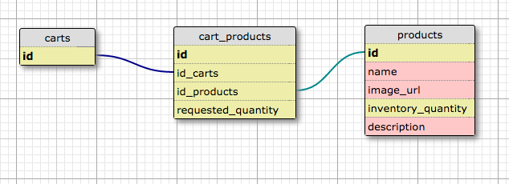

# Rails Shop

## User Stories
User should be able to:
1. view a list of products
2. accumulate a shopping cart of products
3. "buy" shopping cart contents
4. add products to the list of products

Products should be able to:
1. be listed (index)
2. decrease when a user purchases a product
3. increase when a user adds a quantity

## Schema

